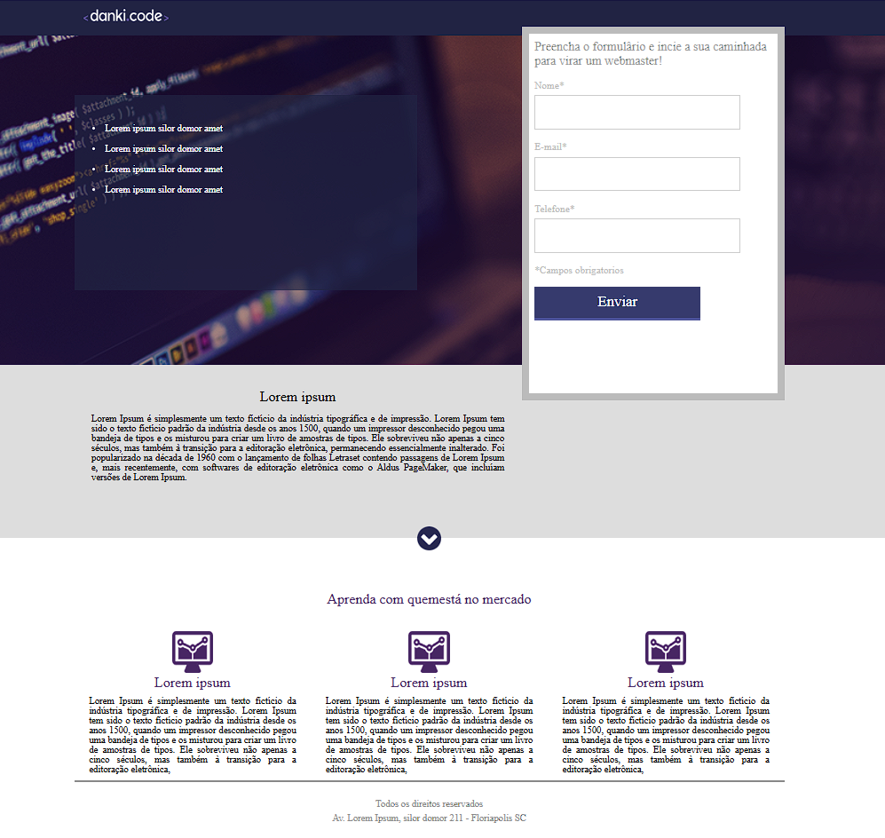

# Landing Page de Captura - Projeto 01 (Danki Code)

Este projeto é uma Landing Page profissional desenvolvida durante o curso de Desenvolvimento Web Completo da **Danki Code**. O objetivo foi criar uma página de captura de leads com foco em conversão, aplicando as melhores práticas de estrutura e estilização.

## 🚀 Tecnologias Utilizadas
* **HTML5**: Estruturação semântica de todo o conteúdo.
* **CSS3**: Estilização personalizada, uso de Google Fonts e sistema de cores.
* **Layout**: Implementação de sistema de floats e posicionamento para organização dos elementos.

## 🛠️ O que eu aprendi
Neste projeto, foquei em consolidar conceitos fundamentais:
* **Box Model**: Gestão correta de margens, bordas e preenchimentos (`border-box`).
* **Formulários**: Criação e estilização de campos de input e botões de submissão.
* **Organização**: Estruturação de diretórios profissional (pastas para imagens, CSS e fontes).

## 📸 Demonstração

*(Dica: Pode substituir este caminho por um print do seu site)*

## 🔗 Link para o Projeto Online
[Clique aqui para ver o site em funcionamento](SEU-LINK-DO-GITHUB-PAGES-AQUI)
